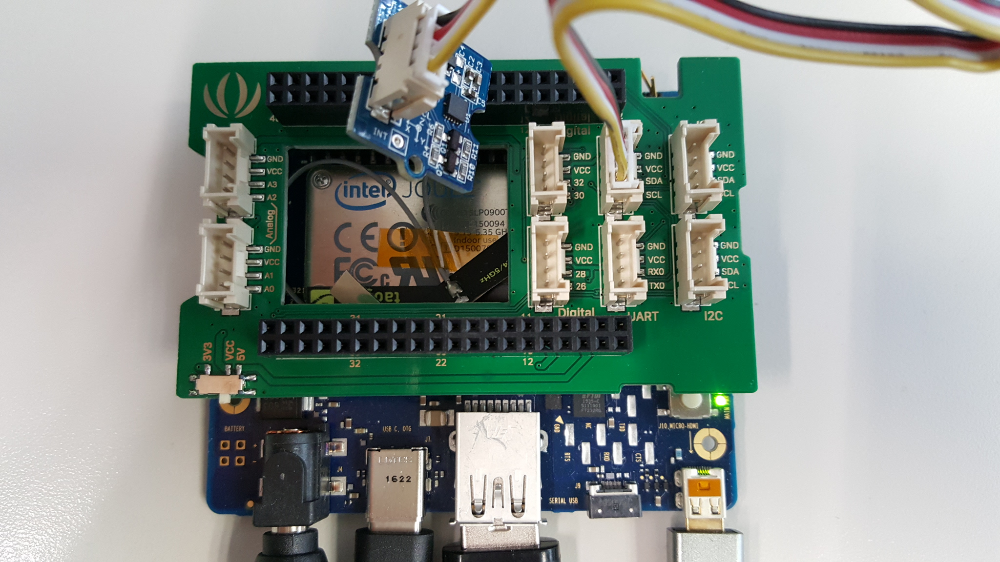

# cordova-plugin-device-motion

This plugin provides access to the device's accelerometer. The accelerometer is
a motion sensor that detects the change (_delta_) in movement relative to the
current device orientation, in three dimensions along the _x_, _y_, and _z_
axis.

Access is via a global `navigator.accelerometer` object.

Although the object is attached to the global scoped `navigator`, it is not available until after the `deviceready` event.

    document.addEventListener("deviceready", onDeviceReady, false);
    function onDeviceReady() {
        console.log(navigator.accelerometer);
    }

## Pre-requisites

- Joule device
- Following individual components:
    - 1 [Grove - 3-Axis Digital Accelerometer(±1.5g)](http://wiki.seeed.cc/Grove-3-Axis_Digital_Accelerometer-1.5g/)
    - jumper wires
    - Schematics for Intel Joule
    

## Installation

    cordova plugin add https://github.com/fujunwei/cordova-plugin-device-motion.git

## Supported Platforms

- Android Things

## Sample Testing

    cordova create deviceMotionTesting org.example.deviceMotionTesting deviceMotionTesting --template https://github.com/fujunwei/cordova-template-reference.git#device_motion_testing
    cd deviceMotionTesting
    cordova platform add android
    cordova plugin add https://github.com/fujunwei/cordova-plugin-device-motion.git#android_things
    cordova run

## [Game Demo](https://github.com/fujunwei/MOOC-game)

    It's use device motion to play a game.

## Methods

- navigator.accelerometer.getCurrentAcceleration
- navigator.accelerometer.watchAcceleration
- navigator.accelerometer.clearWatch

## Objects

- Acceleration

## navigator.accelerometer.getCurrentAcceleration

Get the current acceleration along the _x_, _y_, and _z_ axes.

These acceleration values are returned to the `accelerometerSuccess`
callback function.

    navigator.accelerometer.getCurrentAcceleration(accelerometerSuccess, accelerometerError);

## navigator.accelerometer.watchAcceleration

Retrieves the device's current `Acceleration` at a regular interval, executing
the `accelerometerSuccess` callback function each time. Specify the interval in
milliseconds via the `acceleratorOptions` object's `frequency` parameter.

The returned watch ID references the accelerometer's watch interval,
and can be used with `navigator.accelerometer.clearWatch` to stop watching the
accelerometer.

    var watchID = navigator.accelerometer.watchAcceleration(accelerometerSuccess,
                                                           accelerometerError,
                                                           accelerometerOptions);

- __accelerometerOptions__: An object with the following optional keys:
  - __frequency__: requested frequency of calls to accelerometerSuccess with acceleration data in Milliseconds. _(Number)_ (Default: 10000)

## navigator.accelerometer.clearWatch

Stop watching the `Acceleration` referenced by the `watchID` parameter.

    navigator.accelerometer.clearWatch(watchID);

- __watchID__: The ID returned by `navigator.accelerometer.watchAcceleration`.

## Acceleration

Contains `Accelerometer` data captured at a specific point in time.
Acceleration values include the effect of gravity (9.81 m/s^2), so that when a
device lies flat and facing up, _x_, _y_, and _z_ values returned should be
`0`, `0`, and `9.81`.

### Properties

- __x__:  Amount of acceleration on the x-axis. (in m/s^2) _(Number)_
- __y__:  Amount of acceleration on the y-axis. (in m/s^2) _(Number)_
- __z__:  Amount of acceleration on the z-axis. (in m/s^2) _(Number)_
- __timestamp__: Creation timestamp in milliseconds. _(DOMTimeStamp)_

